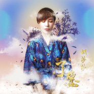

了愿
============================

|  |  |
| :--: | :-- |
| [ 了愿](https://emumo.xiami.com/album/2103498961) | **艺人**: [胡莎莎](../index.md) **语种**: 国语 **唱片公司**: 自在天浩 **发行时间**: 2018年01月24日 **专辑类别**: EP, 单曲 **专辑风格**: 古风 GuFeng Music **播放数**: 222199 **收藏数**: 26 **评论数**: 4  |

## 简介

《了愿》由中国资深佛教研究学者文殊摩诘居士创作词曲，唱作才女胡莎莎倾情献唱。曲风仙乐飘飘，意境清澈空灵，配上古风的编曲及配器，成为中国新派梵音佛乐的突破之作。文殊摩诘居士为表达心中所思所想，每句歌词细细雕琢，并几乎均有出处，如：范仲淹的《苏幕遮·怀旧》、《 御街行·秋日怀旧》等，把这些传颂千古的诗词名句加以拓展，重填为词，再经由莎莎细腻温暖、光彩绽放的绝妙人声唱咏而出，可以说是浑然天成，巧夺天工。许多听者甚至仿佛感受到“漫天孔雀飞舞”的奇异景象。更为巧合的是，该首作品的封面设计师正是由我国孔雀舞领袖杨丽萍老师御用设计师、90后新晋插画家李聪精心打造。  
  
这首歌的大意，是表达为人信仰之师，祈盼寻回旧日徒弟的真情实感，希望今生师徒有缘再度团聚，共同了却前世所发下普度众生的慈悲愿景。梵音得佛力加持，听闻者皆得喜乐。 

## 曲目

## 评论

|  |  |  |  |
| :-- | :-- | :-- | :-- |
|  [虾米用户](https://emumo.xiami.com/u/427323073) 细细聆听，音乐的美。 2020-03-25 20:20 赞(0) 踩(0) | 
 
 |
|  [虾米用户](https://emumo.xiami.com/u/12240656)  2018-11-08 08:42 赞(0) 踩(0) | 
天籁之音
 |
|  [虾米用户](https://emumo.xiami.com/u/8244559)  2018-01-27 01:44 赞(0) 踩(0) | 
******
 |
|  [虾米用户](https://emumo.xiami.com/u/254837040)  2018-01-24 19:42 赞(0) 踩(0) | 
莎莎的声线很适合古风
 |
