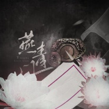

燕青门
============================

|  |  |
| :--: | :-- |
| [ 燕青门](https://emumo.xiami.com/album/2103876732) | **艺人**: [小时](../index.md) **语种**: 国语 **唱片公司**: StreetVoice, 木纹唱片 **发行时间**: 2018年08月01日 **专辑类别**: EP, 单曲 **专辑风格**:  **播放数**: 3382 **收藏数**: 1 **评论数**: 0  |

## 简介

每个人的心中都有个江湖梦。每个心中有江湖的人都有一腔“侠”情。金庸先生曾说过，侠之大者，为国为民。而这首歌，我想再加入一个情字，侠之大者，铁血柔情。  
燕青门是我非常喜欢的一个武术流派，其代表人物有浪子燕青和霍元甲。作为一个生活在和平年代的现代人，热爱传统武学我们该以什么态度去回望历史、将优秀的中国传统武学文化发扬光大呢？怀着这一腔“侠”情，这首动人的《燕青门》就犹如泉水般流淌而出。  
  
注：  
[1]燕青门为武术中的一大门派，属长拳少林派正宗嫡系，为梁山好汉浪子燕青所传。代表人物有燕青、霍元甲、燕子李三等。  
燕青拳又叫迷踪拳，其特点是动作轻灵敏捷，灵活多变，讲究腰腿功，脚下厚实，功架端正，发力充足。中华人民共和国成立后，燕青拳被列为全国武术表演和比赛项目。燕青拳被列为第二批国家级非物质文化遗产。  
[2]指浪子燕青。燕青是中国古典小说《水浒传》中的人物，又名燕小乙，绰号浪子，北京人氏。历史上是否真实存在，有争议。有人认为燕青的原型为太行山忠义军将领梁兴（梁青）梁小哥，或有糅合其形象。  
[3]指霍元甲。霍元甲，天津市西青区精武镇小南河村人，爱国武术家，迷踪拳第七代传人。1909年扬名上海，并创办了精武体育会，培养了大批武术人才，为强健国民体质、传承武术文化做出了突出贡献。  
[4] 间奏部分男声吟唱出自《爱殇》选段，以致敬小时姑娘和《爱殇》  
  
  
Yanqing kongfu, one age-old traditional Chinese martial art, handed down for generations, and became a legend in Jianghu( rivers and lakes in Chinese, refers to fictional society.) Many a story pertaining to it has been circulated among folks. Everyone in Jianghu has ever dreamt of chivalry, which is named spirit of "Xia". How can partisans of Xia spread this spirit all over the world？ the answer may lay in this euphonious love song.

## 曲目

## 评论

|  |  |  |  |
| :-- | :-- | :-- | :-- |
