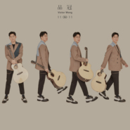

1111
============================

|  |  |
| :--: | :-- |
| [ 1111](https://emumo.xiami.com/album/2108135321) | **艺人**: [品冠](../index.md) **语种**: 国语 **唱片公司**: 海蝶音乐 **发行时间**: 2019年05月15日 **专辑类别**: EP, 单曲 **专辑风格**: 流行 Pop **播放数**: 330 **收藏数**: 1 **评论数**: 0  |

## 简介

《幸福指南編輯部》出品 “幸福自定義”專欄 一終一始 單身幸福 主題曲《1111》 自由多一點，煩惱少一點 單身一時爽 一直單身一直爽 單身幸福主題曲《1111》 單身一時爽 一直單身一直爽 緊接在討論度極高的《最佳前任》後上線的《1111》，其實是《最佳前任》故事的延續。在《最佳前任》『人生如戲，全靠演技』的心狠詞辣後，《1111》則講述了一個，不用演的人生有多幸福的故事。如果說《最佳前任》是一個人感情破敗的終局，那《1111》就是一個人『幸福自定義』的開始。 可能現在很多年輕人已經不知道11月11日，在成為舉國同慶的雙十一購物節之前，是曾經被另一個產業，網路遊戲業的巨頭，開發為『光棍節』的一天。因為四個並排的1，讓這一天變成365天中最孤獨的一天。在那個時候，單身的人們會互相慶祝這一天，終於在情人節的對立面，有了屬於自己的節日。時過境遷，雖然這一天已經成了剁手節，但單身狗的現實困局依舊存在，過年回家會被催婚，熱心同事會來介紹物件，相親行業蓬勃發展，滿互聯網措不及防的狗糧。曾經，成家立業、婚姻家庭，是人們對於幸福的標準。甚至有人說沒有結婚，人生就是不完整。但慢慢地，開始有了不同的聲音，來自幸福的個人選擇。 品冠作為已婚人士，表示自己對婚姻裡獲得的幸福感其實在不斷更新，同時也很理解現在環境下單身狀態的幸福。有些人會選擇單身，選擇一直單身，可能才是他們的幸福。所以才有了這首《1111》。作為作曲人的品冠說數位時代，用數位來表達態度也是一種不錯的選擇。詞作者的部分，品冠特別找來了資深詞作者樓南蔚老師，樓老師為了呼應數位的概念，在歌裡用了很多『一』來傳達單身的幸福感受。特別副歌是最後一句『自由多一點，煩惱少一點』，記憶度特別高。直接點出了單身最大的幸福，就是來自於『自由』。伊曼努爾•康得說：『自由不是想幹什麼就幹什麼，而是想不幹什麼就有能力不幹什麼。』現在的年輕人說：『單身一時爽，一直單身一直爽。』單身的幸福，就是不想結婚、不想談戀愛，就可以選擇不要。尤其是通過身邊有伴侶的朋友們或者自身的感情經歷，明白兩個人相處的不容易之後，只需要想一想那是自己想要的生活麼？單身就更不是一種無奈，而是一種自定義的選擇。 在這首歌裡，1111，不再是最孤獨的日子，而是最自由的日子，因為每個1都是獨立自主、有個人空間的個體。 新專輯《幸福指南編輯部》 『幸福自定義』 專欄音樂故事 從一個人開始 除了主題概念曲《幸福指南》外，專輯內九大幸福主題曲：告白的幸福（《你願不願意》）、認定的幸福（《My LOVE》）和吃貨的幸福（《珍珠奶茶》）；遺憾的幸福（《上海站》）、去你的幸福（《最佳前任》）和虐戀的幸福（《暗戀美學》）；單身的幸福（《1111》）、真實的幸福（《線下限定》）和自我的幸福（《投己所好》）。每一首都是一個故事，有著不同的關於幸福的詮釋角度，每一首歌的主人公，對於幸福都有自己的定義。為此設定，企劃團隊特別邀請了9位優秀的撰稿人，來為這九首歌撰寫歌曲相對應的故事。 《1111》是『幸福自定義』專欄的第一篇音樂故事，請到的是《國際公關》雜誌專欄作家、資深公關從業者、自媒體“在公關”主筆人姚素馨。寫的是《1111》的前傳或者說是歌裡主人公所說的身邊那些朋友的故事，描述了兩個人在一起還要飆演技，無法做真實和自由的自己。從而導致主人公明白了幸福是可以自訂和掌握自己想要的生活。『幸福自定義』，從一個人開始。 自訂人生歌單，自訂幸福指南。 “幸福自定義”音樂故事專欄 單身的爽，在於不用“演”了 執筆：姚素馨 資深公關從業者，《國際公關》雜誌專欄作者，自媒體“在公關”主筆。 有句很爛俗的話，人生如戲，全靠演技。 一次一次事實暴擊，似乎沒有讓我變乖。雖然我不並相信“真正純粹的愛情就是可以在對方面前肆無忌憚地做自己”，只是簡單的，不想再演什麼。 所以，我們的故事就變得有點硬核。 從一開始，我就說你去找個“傻白甜”吧，我這樣的很難搞。我火眼金睛，銅皮鐵骨，社會早就教會我“男人的嘴、騙人的鬼”。 你笑笑說，我從沒想過要搞定你。老天給了你這樣的頭腦和脾氣，我也不指望你會逆來順受、瞻前顧後、委曲求全。你喜歡怎樣就怎樣，你怎樣我都喜歡。 我也跟著笑，如果我說我信了，你信嗎？ 演技對於我來說，是一件可以有的東西。 上班總會遇到讓人不省心的同事，不怕神一樣的對手，就怕豬一樣的隊友。你再能幹，也不會正好能組成個複聯這樣的隊伍，是不是？在別人即便幹了蠢事，但你還不能翻臉的時候，只能發揮職場友愛部門聯動的演技“要不換這種方式再試一次，辛苦你了，最好週五前能收到哦。” 下班回家，還要哄哄需要互飆演技的太后，白天還能連跳3小時廣場舞，看到你回家吃飯就捧著胸口說心臟疼。於是，趕緊陪笑臉：“媽，我帶你去旅行吧，想去哪裡？” 在我眼中，值得付出演技的，只有父母。職場，是衣食父母，同等待遇。 我把我的想法講給你聽。 你又笑笑，問，要是我做了你的長期飯票，是不是也就成了衣食父母？ 我說，你有把握跟我長期作戰？演員拍戲也就幾個月，還得歇歇呢。 你很有信心的樣子，點點頭。 你很盡力得演出我想要的。即便是過分的要求，也至多淡淡一笑。 我說我想去一個人去旅行，你就給我定機票，臨行還不斷關照：自己當心一點；我的朋友們愛開玩笑，又吵又鬧，形形色色。我跟他們見面，不用看你的眼色，也不用擔心你會打電話來“查崗”；我不喜歡做飯的時候，你說外面吃可以多換花樣，我想做飯的時候，你就說做得好吃，然後一碗一碗的吃。 你很知道我，從不說我最討厭的那兩句話：“你沒有考慮過我的感受”以及“我這是為你好的”。 最後，我說我們分開吧的時候，所有人都感到驚訝。總是有人來勸：你已經找到最適合的人，還在鬧什麼。 只有你不說話。 不知是你演技不好，還是我拆穿得太早。假裝什麼都不知道，演起來最費勁。 我知道“你開心就好”是演的，我知道“我愛你超過愛我自己”是演的，我也知道“真的不需要你做什麼改變”是演的。我不是說你是存心演戲，而是兩個人的相處，必然需要這些。 我怎麼辦？怎麼可能安安心心做自己？ 我繼續演無動於衷？還是改演深受感動？ 還有一句爛俗的話，自由，不是你可以選擇做什麼，而是你可以選擇不做什麼。 單身的爽，在於不用“演”了。 選擇單身。我討厭的不是你，而是，必須演下去。

## 曲目

- [1111](./2108135321/UEzti44567b.md)

## 评论

