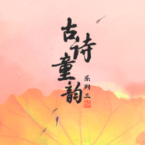

古诗童韵系列三
============================

|  |  |
| :--: | :-- |
| [ 古诗童韵系列三](https://emumo.xiami.com/album/2108211007) | **艺人**: [吴彤](../index.md) **语种**: 国语 **唱片公司**: 成桥文化 **发行时间**: 2018年07月12日 **专辑类别**: 录音室专辑 **专辑风格**: 氛围音乐 Ambient **播放数**: 3162 **收藏数**: 23 **评论数**: 1  |

## 简介

1、《陋室铭》

刘禹锡的《陋室铭》写的是“陋室”，赞美的是“德馨”，这种精神和理念给了作曲家音乐上的灵感。歌曲中融入了Jazz风格中的Fusion元素，来表现这种“朗朗上口，沁人心脾”。音乐本身并没有按照传统的歌曲结构来处理，而是由“名文”本身的架构来完成的，这也使得这首诗词与音乐结合的非常紧密。古筝在歌曲中的使用使这种Fusion的感觉更加中国化，这也是一种复古风格的体现。

2、《题破山寺后禅院》

这是一首咏物抒情、咏物抒志的诗作。描写了清晨、古寺、竹林、小鸟等这些景象，偶尔还能听到禅院的钟声，很阳光、很有画面感。作曲家用一种很宁静、很有中国古画风格意境的旋律来表现这首诗，在演唱上用童声合唱的方式。配器整体上是一种简约的风格，并且特别运用了笙。笙是中国非常古老的民族乐器，有空灵的音色特点。笙加上鼓点的节奏，让这首歌显得既空阔又灵动。

3、《采薇》

《采薇》中的几句“昔我往矣，杨柳依依。今我来思，雨雪霏霏...”历来被认为是《诗经》中的经典名句，言浅意深。音乐旋律营造出一种悠远深遂的意境，编配风格则简约并具有一定空间感。考虑到童声的演唱和学唱，在音区上没有过大的起伏。

4、《舟过安仁》

这首诗浅白如画，充满情趣，展示了无忧无虑的两个小渔童的充满童稚的行为中透出的只有儿童才有的奇思妙想和聪明。歌曲以两个4岁左右小朋友的第一视角声音来表现两个小渔童无忧无虑的生活状态，后加入一位大人的声音带领孩子一起形成呼应。

5、《江城子·密州出猎》

苏轼写这首词时四十岁，“老夫聊发少年狂”既豪迈，又悲情。旋律从结构上是先抑后扬、再抑再扬。前面两遍完整的主歌和副歌，并未释放全部的情感和力量，“持节云中，何日遣冯唐？”这句作曲家在音乐上做了一个转折，情绪有一个突变，通过转调模进使音乐呈现出“梦的氛围”，“会挽雕弓如满月，西北望，射天狼”这句通过转调达到全曲高潮。而演唱家吴桐老师的嗓音，仿佛穿越千年而来，充满了历史感和沧桑感，完美的诠释了这首作品。

这首歌采用电声四大件的编制，加上弦乐四重奏和大提琴独奏简单点缀。另外作曲家在弦乐四重奏混响的处理上，采用近场小混响的手法，寻求突破。

6、《山居秋暝》

这首诗是从对山间景色的描写，到人物的刻画，继而延伸到诗人想要抒发的情感这种递进关系展开的。曲子的结构也是根据诗词本身的递进关系而设计的。在配器方面，钢琴流动性的支体描绘出山间静谧却不失生命力的景色，笛子与琵琶的运用是对人物形象的刻画，而弦乐，打击乐与合唱声部的加入则试图勾勒出整幅“画”的立体感。

7、《长歌行》

这首歌用传统的合唱、钢琴与弦乐队编曲配器构成。围绕着名句“少壮不努力，老大徒伤悲”展开，告诫孩子们要好好学习，天天向上，不要等老了再后悔自己曾经没有发愤图强。

8、《敕勒歌》

《敕勒歌》力图还原诗词中“风吹草低见牛羊”般淳朴、宽广的意向。旋律上并没有局限在传统的中国蒙古族音调，歌曲整体曲风偏流行民谣，运用了一些世界音乐风格的打击乐，竹笛和吉他配合通俗女声演唱。配器上，尽量做到精致简化，就好像一副描绘草原的画卷徐徐展开。

## 曲目

## 评论

|  |  |  |  |
| :-- | :-- | :-- | :-- |
|  [虾米用户](https://emumo.xiami.com/u/933157) 泥豪啊同志！ 2020-09-16 01:26 赞(0) 踩(0) | 
已
 |
