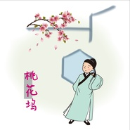

桃花坞
============================

|  |  |
| :--: | :-- |
| [ 桃花坞](https://emumo.xiami.com/album/2104955996) | **艺人**: [齐栾](../index.md) **语种**: 国语 **唱片公司**:  **发行时间**: 2019年06月21日 **专辑类别**: 录音室专辑 **专辑风格**: 古风 GuFeng Music **播放数**: 2011 **收藏数**: 4 **评论数**: 3  |

## 简介

桃花坞里桃花庵，桃花庵下桃花仙；  
桃花仙人种桃树，又摘桃花换酒钱。  
  
《桃花坞》是吴梦唱片姑苏三部曲的最后一首，由古风圈著名女歌手“齐栾”和吴梦唱片音乐总监黄耀德（姑苏三部曲编曲、制作人）联袂演唱。起句“江南忆，最忆是姑苏。七里山塘到虎丘，千年一梦平江路。苏州园林行不足，阊门里还有个桃花坞”起承转合，既回顾了前两首山塘街《花草梦苏州》、平江路《醉平江》，又生动自然地引出了苏州近年来重点打造的第三个历史文化街区---桃花坞。  
  
吴梦唱片为《桃花坞》一共创作了两个版本，第一个版本是词作者张艺伟读完苏州时尚旅游口袋书《情调苏州》里写桃花坞的那篇《桃花坞里有个唐伯虎，是春宫画的鼻祖》后觉得笔风清奇，就乘兴故地重游并坐在夹岸柳树下即兴涂鸦的词作。邀请老朋友李金龙一起做出了一首浓浓R&amp;B曲风的实验性作品，同样非常有趣。但明显跟姑苏三部曲这个策划案格格不入，于是又重新创作了这首古风版。第一版不破不立，假作真时真亦假（参见“风雅桃花坞”公众号整理发布的《风流才子唐伯虎：像我这样优秀的人，本该灿烂过一生》），第二版的歌词写的仍然是文学艺术形象中的那个文艺青年版唐伯虎，“三笑留情点秋香，一身诗意扮家奴”。山塘街和平江路的车水马龙代表了姑苏繁华图，桃花坞则像唐伯虎一样躲在桃花丛中，成就一个安静的美男子和一处文人墨客、文艺青年们宁谧的的心灵家园与精神故土。 

## 曲目

## 评论

|  |  |  |  |
| :-- | :-- | :-- | :-- |
|  [虾米用户](https://emumo.xiami.com/u/412485686)  2019-06-28 15:27 赞(0) 踩(0) | 
******
 |
|  [虾米用户](https://emumo.xiami.com/u/33179)  2019-06-26 19:24 赞(0) 踩(0) | 
喜欢她的声音，很多年了
 |
|  [虾米用户](https://emumo.xiami.com/u/31102249)  2019-06-23 00:13 赞(0) 踩(0) | 
大齐精品
 |
